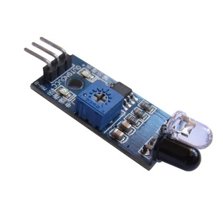
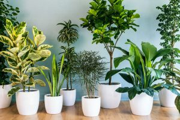
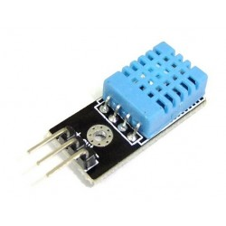

# Prática com Arduino
Disciplina: Programação para Internet das Coisas

Curso: Tecnologia em Sistemas para Internet

Aluna: Fernanda Beatriz Tavares Gomes

## Proposta de Projeto 1: 
No país o número de pessoas portadoras de alguma deficiência física é bem alto, e é indispensável a busca por melhores condições de vida, segurança e convívio para esses PCDs. Sendo alarmente a quantidade de acidentes relacionados a pessoas com deficiência visual, em ruas, pontos de ônibus, supermercados e até mesmo suas casas.

Visando esse problema, essa proposta tem o objetivo de automatizar uma bengala usada por deficientes visuais, para informar se existe algum item no caminho, na altura da bengala, como árvores, hidrantes, objetos em geral em qualquer lugar.

Similar a um cão-guia, e bengalas inteligentes automizadas, algumas possuem conexão bluetooh, GPS, mas acabam não sendo acessíveis a todos, por conta do valor. Essa ideia seria de uma forma mais simples e com custo mais baixo.

Através de um sensor de obstáculo, que será acionado quando houver algum item no caminho, acionando assim um som avisando para a pessoa, que poderá parar ou trocar a rota, evitando possiveis acidentes, facilitando a locomoção.

## Proposta de Projeto 2:

Cultivo de plantas ornamentais residenciais tem se tornado muito comum, além da decoração, auxiliam na harmonização do ambiente, ajudam na redução do estresse. Essa proposta tem o objetivo de fazer o controle de dados das plantas domésticas, e a auto irrigação de flores, cactos, suculentas, plantas em geral, saber sobre a umidade, luminosidade e qual o tempo certo de irrigar.

Com a vida corrida, muitas vezes por conta do trabalho, viagens, acontence dessas plantas domesticas, não terem o cuidado necessário para florir/ter saúde.

Através da construção de um dispositivo com sensor de umidade, luminosidade e acionamento para regar a planta, quando o nivel de umidade estiver baixo/precisando da irrigação, se a iluminação que a planta está recebendo é suficiente, sabendo que algumas plantas precisam se mais sol e outras de sombra, facilitando assim o cuidado, obtendo a saúde da planta e harmonizando nossos lares.

